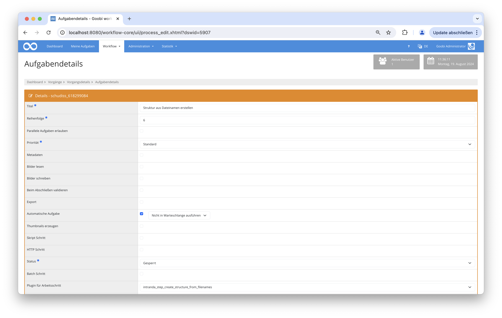

## Einführung
Diese Dokumentation erläutert das Plugin zur Strukturdatenerfassung von Bildern basierend auf deren Dateinamen.

## Installation
Um das Plugin nutzen zu können, müssen folgende Dateien installiert werden:

```bash
/opt/digiverso/goobi/plugins/step/plugin-step-create-structure-from-filenames-base.jar
/opt/digiverso/goobi/config/plugin_intranda_step_create_structure_from_filenames.xml
```

## Überblick und Funktionsweise
Nachdem das Plugin installiert und konfiguriert wurde, kann es innerhalb eines Arbeitsschrittes von Goobi genutzt werden.

Dazu muss innerhalb der gewünschten Aufgabe das Plugin `intranda_step_create_structure_from_filenames` ausgewählt werden. Des Weiteren kann die Checkbox `Automatische Aufgabe` gesetzt werden.




Die Arbeitsweise des Plugins innerhalb des korrekt konfigurierten Workflows sieht folgendermaßen aus:

* Wenn das Plugin innerhalb des Workflows aufgerufen wurde, durchläuft es alle Bilder des Master-Ordners und legt für jedes Bild ein neues Strukturelement an.
* Enthält ein Bild im Dateinamen jedoch einen in der Konfigurationsdatei definierten Buchstabenfolge, dann wird dieses Bild dem letzten Strukturelement hinzugefügt.

## Konfiguration
Die Konfiguration des Plugins erfolgt in der Datei `plugin_intranda_step_create_structure_from_filenames.xml` wie hier aufgezeigt:

{{CONFIG_CONTENT}}

{{CONFIG_DESCRIPTION_PROJECT_STEP}}

Parameter               | Erläuterung
------------------------|------------------------------------
type           | Der Typ für das Strukturelement das angelegt werden soll |
infix          | Die Buchstabenfolge, die im Dateinamen vorkommen kann, wodurch das Bild an das vorherige Strukturelement gehängt wird|

