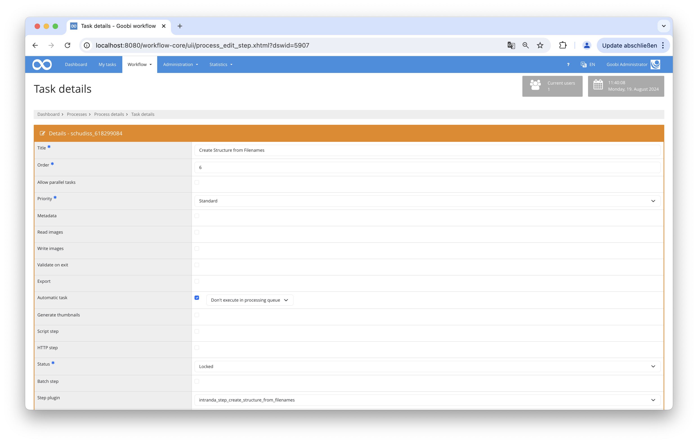

## Introduction
This documentation explains the plugin for capturing structured data from images based on their filenames.

## Installation
To use the plugin, the following files must be installed:

```bash
/opt/digiverso/goobi/plugins/step/plugin-step-create-structure-from-filenames-base.jar
/opt/digiverso/goobi/config/plugin_intranda_step_create_structure_from_filenames.xml
```

## Overview and functionality
Once the plugin is installed and configured, it can be used within a Goobi workflow step.

To do so, the plugin intranda_step_create_structure_from_filenames must be selected within the desired task. Additionally, the Automatic Task checkbox may be selected.



The plugin works as follows within a properly configured workflow:

When the plugin is called within the workflow, it processes all images in the master folder and creates a new structural element for each image.
However, if an image filename contains a string defined in the configuration file, that image will be added to the last structural element.


## Configuration
The configuration of the plugin is done in the file `plugin_intranda_step_create_structure_from_filenames.xml` as shown here:

{{CONFIG_CONTENT}}

{{CONFIG_DESCRIPTION_PROJECT_STEP}}

| Parameter            | Description                                                                                      |
|----------------------|--------------------------------------------------------------------------------------------------|
| structureElementType | The type of structure element that should be created                                              |
| filenameString       | The sequence of letters that can appear in the filename, causing the image to be attached to the previous structure element |
