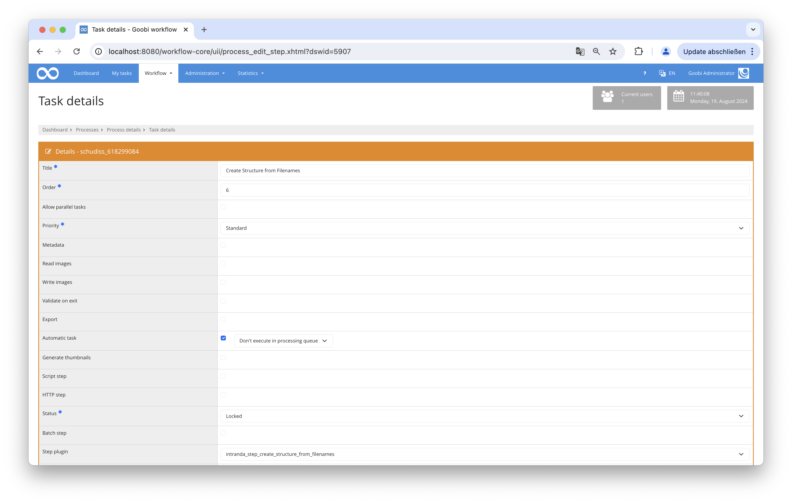

## Introduction
This documentation explains the plugin for capturing structural data from images based on their file names.

## Installation
To be able to use the plugin, the following files must be installed:

```bash
/opt/digiverso/goobi/plugins/step/plugin-step-create-structure-from-filenames-base.jar
/opt/digiverso/goobi/config/plugin_intranda_step_create_structure_from_filenames.xml
```

## Overview and functionality
Once the plugin has been installed and configured, it can be used within a single Goobi step.

To do this, the plugin `intranda_step_create_structure_from_filenames` must be selected within the desired task. The `Automatic task` checkbox can also be selected.




The plugin works as follows within the correctly configured workflow:

* If the plugin has been called within the workflow, it runs through all images in the master folder and creates a new structure element for each image.
* However, if an image contains a sequence of letters defined in the configuration file in the file name, then this image is added to the last structure element.
* The `overwrite` parameter controls whether an existing structure is replaced on a subsequent run (`true`) or preserved while only missing groups are appended (`false`). This prevents duplicate entries when the plugin is executed more than once.

## Configuration
The plugin is configured in the file `plugin_intranda_step_create_structure_from_filenames.xml` as shown here:

{{CONFIG_CONTENT}}

{{CONFIG_DESCRIPTION_PROJECT_STEP}}

Parameter               | Explanation
------------------------|------------------------------------
type           | The type for the structure element to be created |
infix          | The sequence of letters that can appear in the file name, whereby the image is appended to the previous structure element|
overwrite      | Controls the behaviour when the plugin is run again. If `true`, all existing structure elements, pages and file entries are removed and completely rebuilt from the master folder. If `false` (default), existing entries are kept and only groups whose files are not yet present in the physical structure are added. This avoids duplicate entries on repeated runs. |

